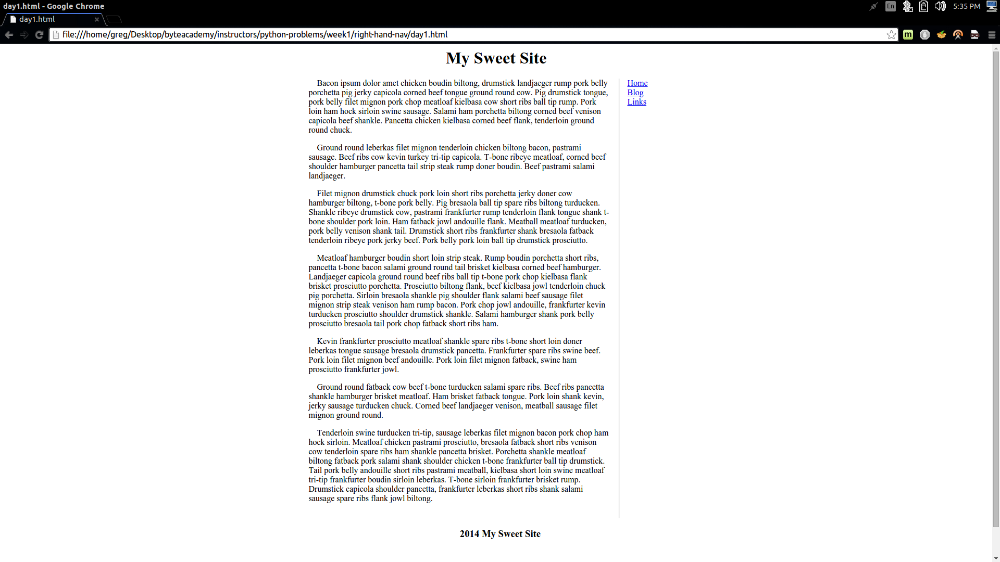

Right Hand Navigation
=====================

Using this screenshot as a guide, create a right hand navigation template.

You will need atleast the following block elements:

* Container  
* Nav  
* Content / Aside  
* Footer  

The footer should be fixed to the page, so it is present at all times no matter where you scroll.

Bonus points for using [Bacon Ipsum](http://baconipsum.com/).
