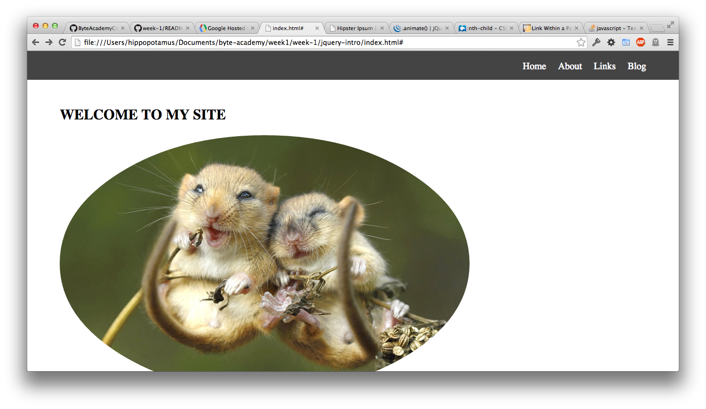
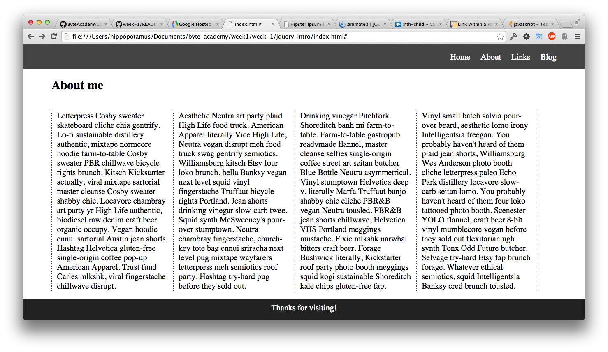

## CSS Challenge

In this assignment, you will doing the css for a site. The HTML is already done for you, so don't touch it, unless you're adding the about link (instrutions below).  
Included are pictures of what the site should look like. Here are a few things to help:  
* the color of the background in nav is #444, as well as for the dashed border lines
* the background color for the footer is #222
* look up border radius. Can you make the picture a circle as well?
* You will need to use nth-child() in the css
* the footer should clear everything above it
* do all of your sizes in em or %
* make the about link in the header go to the about section (you can change the html here and only here)

**Why use em or %?** When you code your css using px, you're defining the exact amount of pixels for the size. This seems great, until you go a different size monitor. Using % says what percent of the screen to take up. Em defines the size based on the px definition in the document. By default, this is 16px. By using em, you can size everything in relation to each other, and not have to change 1 pixel every time you make a minor adjustment.  

Check out application.js. Figure out what it's doing. See if you can explain it to a friend.

